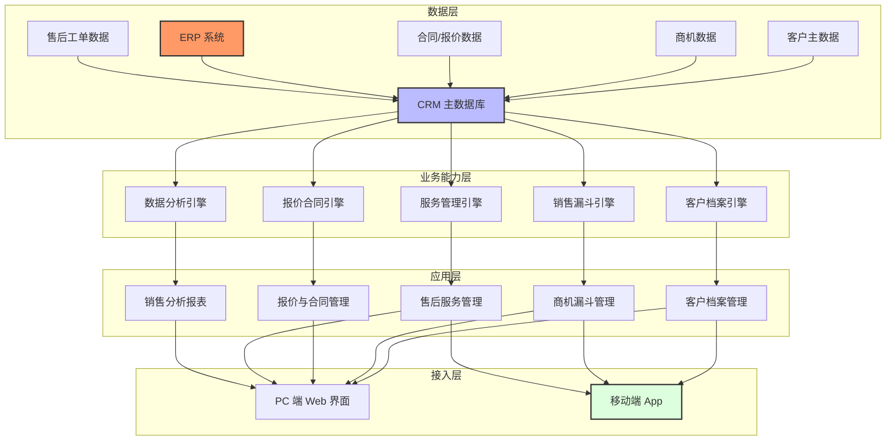

# 长机科技 CRM 客户关系管理系统解决方案

## 1. 客户现状与需求

### 项目概览表

| 项目要素 | 内容 |
|---------|------|
| 客户名称 | 宜昌长机科技有限责任公司 |
| 行业领域 | 装备制造 > 机床工具 / 齿轮加工装备 |
| 项目类型 | 新建 CRM 系统（初次接触阶段） |
| 核心目标 | 客户资产化运营 + 复杂销售过程精细化管理 |
| 预算规模 | 未明确（初次沟通阶段） |
| 上线时间 | 未明确 |

### 客户概况

长机科技做数控齿轮加工机床，插齿机在国内细分市场排第一。总资产超 5 亿元，客户主要是风电、工程机械、汽车零部件这类大型 B2B 厂商，设备单价从几十万到几百万都有，一单下来半年到一年很正常。售后维保和备件也是长期饭票。公司已经过了 DCMM 认证，信息化底子不差。

现在的 CRM 基本就是 Excel 加销售脑子里的记忆。没有统一平台，客户信息各管各的，新人接手只能靠前任留下的纸条；商机跟到哪了说不清楚，老板问起来只能靠感觉；报价和合同版本多了自己也搞不清哪个是最新。

### 当前挑战

| 挑战领域 | 现状问题 | 业务影响 |
|---------|---------|---------|
| 客户档案 | 客户信息散落在各销售个人手中，缺乏统一档案 | 人员变动导致客户关系断层，关键决策人信息丢失 |
| 销售过程 | 商机阶段靠口头跟踪，缺乏标准化漏斗管理 | 商机进展不透明，管理层难以把控节奏 |
| 报价管理 | 复杂定制产品报价依赖人工核算，版本混乱 | 报价效率低，条款追溯困难，影响合同质量 |
| 售后服务 | 售后服务与销售系统分离，信息断层 | 客户体验割裂，售后商机难以反哺销售 |
| 数据利用 | 无系统化客户分析和业绩看板 | 销售策略缺乏数据支撑，难以识别流失风险 |
| 移动办公 | 外出拜访时无法及时录入跟进记录 | 信息滞后，跟进节奏松散 |

### 核心需求

#### 业务需求

| 需求项 | 优先级 | 描述 |
|-------|-------|------|
| 客户档案管理 | P0 | 建立完整客户电子档案，记录企业规模、行业、联系方式、关键决策人（技术选型者、采购评估者、高层拍板者）、历史交易记录 |
| 销售漏斗管理 | P0 | 从线索到合同的全流程阶段定义，追踪每个商机的进展阶段、预计签单金额、预计签单时间 |
| 报价与合同管理 | P0 | 针对定制化产品的多版本报价单管理，关联设备配置和价格要素，支持合同条款版本追踪和执行进度管理 |
| 售后服务管理 | P1 | 设备安装调试、维保服务、备件销售的全流程跟踪，售后与销售信息贯通 |
| 销售分析报表 | P1 | 销售业绩、客户贡献度、转化率、商机阶段分布等多维度分析，支持管理层决策 |
| ERP / 生产系统集成 | P1 | 与现有 ERP 对接，同步订单状态、生产进度和发货信息 |
| 移动端支持 | P2 | 外出拜访时通过手机录入客户信息和跟进记录 |

#### 技术需求

| 需求项 | 描述 |
|-------|------|
| 部署方式 | 私有化部署，核心客户数据不出企业内网 |
| 系统集成 | 与现有 ERP 系统对接，开放 API 支持未来扩展 |
| 技术架构 | 支持私有化部署的微服务或模块化架构 |
| 用户规模 | 支撑 20-50 人规模销售及售后团队并发使用 |

### 约束条件

| 约束类型 | 约束内容 |
|---------|---------|
| 预算约束 | 未明确，需在调研阶段进一步确认 |
| 时间约束 | 未明确，需结合预算和范围确定里程碑 |
| 技术约束 | 需兼容现有 IT 架构，支持私有化部署 |
| 数据安全 | 客户信息属于商业机密，必须本地化存储 |

---

## 2. 解决方案

### 整体思路

方案核心做三件事：先把客户信息从各人手里收回来变成公司资产；再把销售过程管起来，什么阶段、预计多久、卡在哪里都看得见；最后把售后接上，卖出去不是结束，设备交付、长期维保都算客户生命周期。三件事做完，客户不随人走，管理层有数字可看，销售节奏有章可循。

### 方案架构

### 功能设计

| 功能模块 | 解决问题 | 业务价值 |
|---------|---------|---------|
| **客户档案管理** | 客户信息分散、决策人记录缺失、人员变动导致客户流失 | 建立企业级客户资产，沉淀关键决策人图谱，支持客户全生命周期追溯 |
| **销售漏斗管理** | 商机跟进靠个人把控，阶段不透明，节奏不可控 | 标准化商机阶段，异常商机自动预警，管理层实时掌握销售节奏 |
| **多版本报价管理** | 定制产品报价版本混乱，配置要素多，核算效率低 | 结构化报价模板，自动关联设备配置要素，报价版本可追溯 |
| **合同管理** | 合同条款分散，执行进度不可见 | 合同数字化管理，关联设备配置和报价，执行进度全程可视化 |
| **售后服务管理** | 售后与销售系统分离，维保和备件信息断层 | 打通售后工单、备件销售、设备档案，支持从签约到维保的完整链路 |
| **ERP 集成** | 订单状态、生产进度、发运信息需人工传递 | 与 ERP 系统实时同步，销售人员在一个界面看到订单全流程 |
| **销售分析报表** | 缺乏数据支撑管理决策 | 多维度分析业绩、客户贡献、商机转化，支持目标管理和绩效考核 |
| **移动端支持** | 外出拜访时无法及时记录，信息滞后 | 手机端快速录入拜访记录、查看客户信息、接收商机预警 |

### 技术方案

#### 系统架构

- **部署方式**：私有化部署，支持在客户机房或私有云环境运行
- **技术栈**：采用模块化架构，前端 Web + 移动端，后端支持微服务或单体模块化部署，关系型数据库存储业务数据
- **集成方案**：
  - 通过 RESTful API 与现有 ERP 系统对接（前提条件：ERP 系统支持标准 API 接口，具体品牌和版本待调研确认）
  - 支持与 OA 系统（审批流）的集成
  - 预留数据导入导出接口，支持历史数据迁移
- **移动端**：微信小程序（开发周期短、用户无需安装，支持私有化部署）
- **性能要求**：支持 50 用户并发，页面响应时间 ≤ 2 秒，数据可用率 ≥ 99.5%

#### 差异化优势

| 优势维度 | syncMind 方案 | 标准 SaaS 产品 |
|---------|--------------|---------------|
| 装备制造适配 | 深度理解 B2B 大客户销售模式，支持复杂定制产品报价 | 通用 CRM 难以适配复杂装备制造业销售流程 |
| 定制化能力 | 按客户实际业务场景定制开发，灵活调整 | SaaS 产品定制受限，功能调整依赖厂商排期 |
| 数据安全 | 私有化部署，客户数据完全本地化存储 | 云端部署，数据归属和安全合规存在风险敞口 |
| 售后与服务贯通 | 从销售到售后全链路打通，支撑长期客户运营 | 多数产品售后模块薄弱或需额外付费 |
| 决策人管理 | 支持多层级决策人图谱，记录技术、采购、高层关系 | 通用联系人管理，无法体现决策链结构 |
| 本地化服务 | 依托本地团队，提供快速响应和持续服务 | 远程服务为主，响应周期长 |

---

## 3. 实施路径

### 实施策略

鉴于当前项目处于初次接触阶段、预算范围尚未明确，建议采用 **MVP 分阶段实施策略**：

- **第一期（核心交付）**：聚焦 P0 功能，快速建立客户档案和销售过程管理能力，交付可见业务价值
- **第二期（能力扩展）**：扩展报价合同、ERP 集成功能，完善售后管理
- **第三期（深化运营）**：上线销售分析报表、移动端，持续优化迭代

此策略可匹配不同预算规模：一期上线即可支撑基本业务，预算明确后逐步扩展。

### 阶段概览

| 阶段 | 周期 | 主要工作 | 交付物 |
|-----|------|---------|--------|
| **需求调研与方案确认** | 3-4 周 | 业务部门深度调研、销售流程梳理、需求规格确认、UI 原型评审 | 需求规格说明书、UI 原型设计稿、详细技术方案 |
| **第一期：核心功能开发** | 6-8 周 | 客户档案、销售漏斗搭建、基础数据初始化 | 核心功能模块（分期交付）、接口文档 |
| **第一期：测试与上线** | 2-3 周 | 系统测试、UAT、用户培训、上线运行 | 测试报告、验收报告、培训材料 |
| **第二期：扩展功能开发** | 6-8 周 | 报价模板配置、ERP 集成开发、售后模块开发 | 扩展功能模块、接口文档 |
| **第二期：测试与上线** | 2-3 周 | 集成测试、性能测试、UAT、上线 | 测试报告、验收报告 |
| **第三期：深化优化** | 上线后持续 | 销售分析报表开发、移动端实现、迭代优化 | 版本更新 |

**总周期**：MVP 第一期约 2-3 个月（10-14 周），全功能约 5-7 个月（20-28 周），具体以预算和范围确认后最终排期为准。

### 关键里程碑

| 里程碑 | 时间节点 | 标志性成果 |
|-------|---------|-----------|
| 需求确认 | 第 3-4 周 | 需求规格说明书评审通过，UI 原型确认 |
| 核心功能上线（第一期） | 第 10-14 周 | 客户档案、销售漏斗模块上线，数据初始化完成 |
| ERP 集成完成（第二期） | 第 18-22 周 | 与 ERP 数据同步测试通过 |
| 全模块上线 | 第 20-28 周 | 所有模块上线培训完成，系统稳定运行（视预算确认后的范围而定） |

---

## 4. 风险与下一步

### 风险应对

| 风险项 | 风险等级 | 应对措施 |
|-------|---------|---------|
| 预算与范围不匹配 | 高 | 在需求调研阶段明确优先级，区分 P0 核心功能和 P1 扩展功能，制定分阶段上线计划 |
| 销售流程标准化阻力 | 中 | 充分调研现有销售团队的实际工作方式，系统设计贴合实际而非强制改变 |
| ERP 集成复杂度超预期 | 中 | 提前进行 ERP 接口调研，明确数据字段映射，预留技术缓冲时间；若 ERP 不支持 API，需评估中间件或定制接口方案 |
| 用户采用率低 | 中 | 选拔关键用户参与需求确认和 UAT，开展针对性培训，展示实际业务价值 |
| 历史数据迁移质量差 | 中 | 评估现有数据完整性，制定数据清洗和补录策略，优先迁移核心客户档案 |

### 下一步行动

| 行动项 | 负责方 | 时间节点 | 说明 |
|-------|-------|---------|------|
| 确认项目预算范围和决策人 | 长机科技 | 本周内 | 明确项目投资规模和最终决策人，推动正式立项 |
| 安排现场业务调研 | 双方 | 下周 | 对销售、售后、管理层进行深度访谈，确认业务细节 |
| 提供 CRM 同类项目参考案例 | syncMind | 调研后 3 日内 | 提供装备制造行业 CRM 项目案例，增强信任度 |
| 提交详细方案和商务报价 | syncMind | 调研后 1 周内 | 基于调研结果完善方案细节和报价方案 |

---

### 待确认事项（假设前提）

以下事项为本方案的技术前提，调研阶段需重点确认：

| 事项 | 现状假设 | 风险影响 |
|-----|---------|---------|
| ERP 系统品牌及版本 | 假设为标准系统，支持 API 集成（置信度：低） | 若为定制 ERP 或不支持 API，集成方案需重新设计，需评估中间件或定制接口方案 |
| 实际用户数量 | 假设 20-50 人（置信度：低） | 影响并发性能设计和 License 成本 |
| 现有 CRM 系统 | 假设无现有系统（置信度：低） | 若已有其他 CRM 产品，需评估数据迁移或系统替换方案 |
| ERP 集成范围 | 假设仅同步订单状态和发货信息（置信度：低） | 实际集成深度可能影响第二期工期 |

<!--
## 修订说明

**修订日期**: 2026-04-02

**修订内容**:

1. **实施路径章节（重大修订）**:
   - 原草案采用"瀑布式"全功能一次性交付方案，与初次接触、预算未明确的项目阶段不匹配
   - 改为 MVP 分阶段实施策略，增加"第一期/第二期/第三期"阶段划分
   - 调整周期估算：MVP 第一期 2-3 个月（10-14 周），全功能 5-7 个月（20-28 周），明确标注"具体以预算和范围确认后最终排期为准"
   - 关键里程碑同步调整，以第一期核心功能上线为核心里程碑

2. **技术方案章节（修订）**:
   - ERP 集成：补充"前提条件：ERP 系统支持标准 API 接口，具体品牌和版本待调研确认"，与风险表格保持一致
   - 移动端：原草案写"原生 App 或微信小程序（视预算和技术路线确定）"，修订为推荐微信小程序方案（开发周期短、用户无需安装、支持私有化部署），消除歧义
   - ERP 集成风险应对：补充"若 ERP 不支持 API，需评估中间件或定制接口方案"

3. **新增"待确认事项"附录（新增）**:
   - 将原 INTERNAL_NOTES 中的关键假设提取为显式列表，供调研阶段核对
   - 每项标注现状假设和置信度，对齐草案 INTERNAL_NOTES 的设计意图

4. **删除 INTERNAL_NOTES 注释块**:
   - 按要求删除草案中所有 INTERNAL_NOTES 注释内容

5. **保留未修改章节**:
   - 项目概览表、客户概况、当前挑战、核心需求（业务需求/技术需求/约束条件）、整体思路、方案架构、功能设计、差异化优势、风险应对、下一步行动等章节内容逐字保留
   - 标题从"解决方案草案"调整为"解决方案"（去除"草案"字样，版本号已在 frontmatter 中体现）

**未涉及修订的维度**:
   - 需求理解：P0/P1/P2 需求划分合理，对齐客户实际痛点，无需修订
   - 成本预算：草案中未给出具体报价数字，修订版已通过 MVP 分阶段策略隐式解决弹性问题
   - 时间资源：修订后的周期估算已体现弹性（"具体以预算和范围确认后最终排期为准"），方向与成本约束一致
-->
